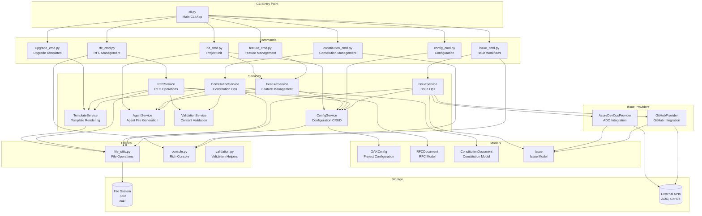
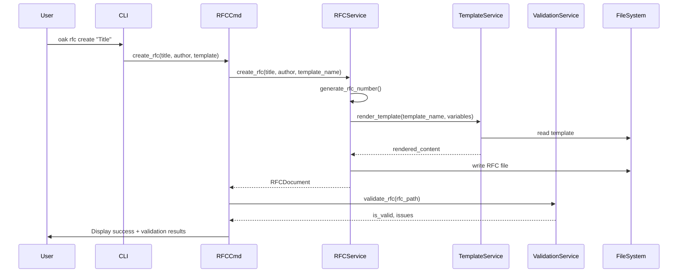
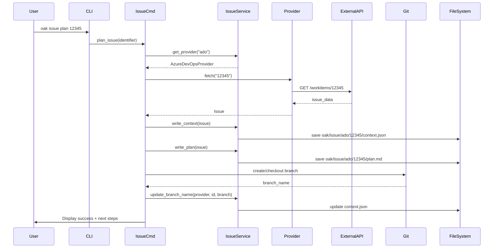

# open-agent-kit Architecture

This document describes the architecture, design patterns, and data flow of open-agent-kit.

---

## Table of Contents

- [Overview](#overview)
- [Architecture Layers](#architecture-layers)
- [Component Diagram](#component-diagram)
- [Data Flow](#data-flow)
- [Directory Structure](#directory-structure)
- [Service Layer Details](#service-layer-details)
- [Design Patterns](#design-patterns)
- [Extension Points](#extension-points)

---

## Overview

open-agent-kit is a CLI tool for managing RFCs, constitutions, and issue workflows with AI agent integration. It follows a **layered architecture** with clear separation of concerns.

### Core Principles

1. **CLI-First Design**: Everything accessible via command line
2. **Template-Driven**: All content generated from Jinja2 templates
3. **AI-Assisted**: Designed for AI agent workflows
4. **Local-First**: Works offline, optional external integrations
5. **Cross-Platform**: Supports Unix/Linux, macOS, Windows

### Technology Stack

- **Language**: Python 3.13+
- **CLI Framework**: Typer (built on Click)
- **UI**: Rich (for beautiful terminal output)
- **Templates**: Jinja2
- **Configuration**: YAML + Pydantic
- **HTTP**: httpx (for external APIs)
- **Validation**: Pydantic v2
- **Testing**: pytest

---

## Architecture Layers

```
┌──────────────────────────────────────────────────────────┐
│                     CLI Layer (Typer)                     │
│  - Argument parsing, validation, help text               │
│  - Rich formatting for beautiful output                  │
│  - Entry point: src/open_agent_kit/cli.py          │
└──────────────────────────────────────────────────────────┘
                          ↓
┌──────────────────────────────────────────────────────────┐
│                   Command Layer                           │
│  - Command implementations                                │
│  - User interaction, progress tracking                    │
│  - Files: src/open_agent_kit/commands/*.py         │
└──────────────────────────────────────────────────────────┘
                          ↓
┌──────────────────────────────────────────────────────────┐
│                   Service Layer                           │
│  - Business logic and orchestration                       │
│  - No CLI dependencies                                    │
│  - Files: src/open_agent_kit/services/*.py         │
└──────────────────────────────────────────────────────────┘
                          ↓
┌──────────────────────────────────────────────────────────┐
│              Model Layer (Pydantic)                       │
│  - Data structures and validation                         │
│  - Type-safe models                                       │
│  - Files: src/open_agent_kit/models/*.py           │
└──────────────────────────────────────────────────────────┘
                          ↓
┌──────────────────────────────────────────────────────────┐
│                   Storage Layer                           │
│  - File system operations                                 │
│  - YAML serialization                                     │
│  - Files: src/open_agent_kit/utils/file_utils.py   │
└──────────────────────────────────────────────────────────┘
```

### Layer Responsibilities

#### 1. CLI Layer
- Parse command-line arguments
- Display help and usage information
- Format output using Rich
- Exit with appropriate status codes

#### 2. Command Layer
- Implement specific commands (init, rfc create, issue plan, etc.)
- Handle user interaction (prompts, confirmations)
- Show progress indicators
- Call service layer methods
- Display results to user

#### 3. Service Layer
- Core business logic
- Orchestrate operations across multiple services
- No direct user interaction
- Return data structures (not formatted output)
- Testable without CLI

#### 4. Model Layer
- Define data structures using Pydantic
- Validate data at runtime
- Provide serialization/deserialization
- Type hints for IDE support

#### 5. Storage Layer
- Read/write files
- Parse/generate YAML
- Handle paths consistently
- Abstract file system operations

---

## Component Diagram



---

## Data Flow

### RFC Creation Flow



### Issue Planning Flow



### Configuration Update Flow

```
User Input
    ↓
ConfigCmd.update_issue_provider()
    ↓
ConfigService.load_config()
    ↓
FileSystem (read .oak/config.yaml)
    ↓
Pydantic Models (validate + parse YAML)
    ↓
ConfigService.update_issue_provider()
    ↓
ConfigService.save_config()
    ↓
FileSystem (write .oak/config.yaml)
    ↓
User Confirmation
```

---

## Directory Structure

### Source Code Layout

```
src/open_agent_kit/
├── __init__.py                 # Package init, version info
├── cli.py                      # Main CLI entry point
├── constants.py                # All constants (CRITICAL: no magic strings!)
│
├── commands/                   # CLI command implementations
│   ├── __init__.py
│   ├── init_cmd.py            # oak init
│   ├── rfc_cmd.py             # oak rfc *
│   ├── constitution_cmd.py    # oak constitution *
│   ├── issue_cmd.py           # oak issue *
│   ├── config_cmd.py          # oak config *
│   ├── upgrade_cmd.py         # oak upgrade *
│   └── feature_cmd.py         # oak feature *
│
├── services/                   # Business logic layer
│   ├── __init__.py
│   ├── config_service.py      # Configuration management
│   ├── feature_service.py     # Feature management & dependencies
│   ├── rfc_service.py         # RFC operations
│   ├── constitution_service.py # Constitution operations
│   ├── issue_service.py       # Issue orchestration
│   ├── template_service.py    # Template rendering
│   ├── agent_service.py       # Agent file generation
│   ├── agent_file_service.py  # Agent file management
│   ├── validation_service.py  # Content validation
│   ├── upgrade_service.py     # Template upgrades
│   └── issue_providers/       # Issue provider implementations
│       ├── __init__.py
│       ├── base.py            # Provider interface
│       ├── azure_devops.py    # Azure DevOps integration
│       └── github.py          # GitHub Issues integration
│
├── models/                     # Pydantic data models
│   ├── __init__.py
│   ├── config.py              # OAKConfig, FeaturesConfig, etc.
│   ├── feature.py             # FeatureManifest
│   ├── rfc.py                 # RFCDocument, RFCStatus
│   ├── constitution.py        # ConstitutionDocument
│   ├── issue.py               # Issue, IssuePlanDetails
│   ├── agent.py               # AgentConfig
│   ├── template.py            # Template models
│   ├── validation.py          # ValidationResult
│   └── project.py             # ProjectInfo
│
└── utils/                      # Utility functions
    ├── __init__.py
    ├── console.py             # Rich console helpers
    ├── file_utils.py          # File operations
    ├── interactive.py         # Interactive prompts
    ├── validation.py          # Validation helpers
    ├── step_tracker.py        # Progress tracking
    ├── version.py             # Version parsing
    └── env_utils.py           # Environment variable helpers

features/                       # Feature packages (in package root)
├── core/                       # Core assets (IDE settings)
│   ├── manifest.yaml
│   └── ide/
│       ├── vscode-settings.json
│       └── cursor-settings.json
├── constitution/               # Constitution feature
│   ├── manifest.yaml
│   ├── commands/              # Agent command templates
│   │   ├── oak.constitution-create.md
│   │   ├── oak.constitution-validate.md
│   │   └── oak.constitution-amend.md
│   └── templates/             # Document templates
│       ├── constitution.md.j2
│       └── decision_points.yaml
├── rfc/                        # RFC feature
│   ├── manifest.yaml
│   ├── commands/
│   │   ├── oak.rfc-create.md
│   │   ├── oak.rfc-list.md
│   │   └── oak.rfc-validate.md
│   └── templates/
│       └── rfc/
│           └── engineering.md.j2
└── issues/                     # Issues feature
    ├── manifest.yaml
    └── commands/
        ├── oak.issue-plan.md
        ├── oak.issue-validate.md
        └── oak.issue-implement.md
```

### User Project Structure

```
project/
├── .oak/                     # Configuration (not versioned)
│   ├── config.yaml            # Project configuration
│   └── features/              # Feature assets (canonical install location)
│       ├── constitution/
│       │   ├── commands/      # Command templates (source of truth)
│       │   │   ├── oak.constitution-create.md
│       │   │   ├── oak.constitution-validate.md
│       │   │   └── oak.constitution-amend.md
│       │   └── templates/     # Document templates
│       │       ├── base_constitution.md
│       │       └── decision_points.yaml
│       ├── rfc/
│       │   ├── commands/
│       │   │   ├── oak.rfc-create.md
│       │   │   ├── oak.rfc-list.md
│       │   │   └── oak.rfc-validate.md
│       │   └── templates/
│       │       ├── engineering.md
│       │       └── architecture.md
│       └── issues/
│           └── commands/      # Issues has commands but no templates
│               ├── oak.issue-plan.md
│               ├── oak.issue-validate.md
│               └── oak.issue-implement.md
│
├── oak/                      # Generated artifacts (versioned)
│   ├── constitution.md        # Project constitution
│   ├── rfc/                   # RFC documents
│   │   ├── RFC-001-title.md
│   │   └── RFC-002-title.md
│   └── issue/                 # Issue artifacts
│       ├── ado/
│       │   └── 12345/
│       │       ├── context.json
│       │       └── plan.md
│       └── github/
│           └── 456/
│               ├── context.json
│               └── plan.md
│
├── .claude/                    # Agent-specific directories (copies from .oak/features/)
│   └── commands/
│       ├── oak.rfc-create.md
│       ├── oak.issue-plan.md
│       └── ...
│
├── .codex/                     # Codex agent directory (if enabled)
│   └── commands/
│
└── .github/                    # GitHub/Copilot (if enabled)
    └── agents/
```

**Feature Asset Architecture**:

1. **Canonical Install Location**: `.oak/features/{feature}/` is the source of truth for all feature assets
   - `commands/` - Agent command templates (oak.{command}.md files)
   - `templates/` - Document templates (if the feature has any)

2. **Agent Directory Replication**: Commands are copied to agent-specific directories
   - `.claude/commands/` for Claude Code
   - `.codex/commands/` for OpenAI Codex
   - `.github/agents/` for GitHub Copilot

3. **Upgrade Flow**:
   - `oak upgrade` updates `.oak/features/{feature}/commands/` and `templates/`
   - Agent directories are also updated to stay in sync
   - This ensures all agents get the latest command versions

---

## Service Layer Details

### ConfigService

**Purpose**: Manage .oak/config.yaml reading/writing

**Key Methods**:
- `load_config()` → OAKConfig
- `save_config(config)` → None
- `update_issue_provider(provider, **kwargs)` → None
- `get_features()` → list[str]
- `update_features(features)` → OAKConfig

**Dependencies**: None (leaf service)

---

### FeatureService

**Purpose**: Feature installation, removal, and dependency resolution

**Key Methods**:
- `get_available_features()` → list[FeatureManifest]
- `resolve_dependencies(features)` → list[str]
- `install_feature(feature_name, agents)` → dict
- `remove_feature(feature_name, agents, remove_config)` → dict
- `can_remove_feature(feature_name)` → tuple[bool, list[str]]

**Dependencies**:
- ConfigService (for feature config)
- AgentService (for command installation)

**Installation Flow**:
1. Creates `.oak/features/{feature}/` directory
2. Copies commands to `.oak/features/{feature}/commands/`
3. Copies templates to `.oak/features/{feature}/templates/` (if any)
4. Installs commands to each agent's directory (e.g., `.claude/commands/`)
5. Updates config to mark feature as enabled

**State**: Stateless (all data in filesystem and config)

---

### RFCService

**Purpose**: RFC document lifecycle management

**Key Methods**:
- `create_rfc(title, author, template_name)` → RFCDocument
- `list_rfcs(status=None)` → list[RFCDocument]
- `get_rfc(rfc_number)` → RFCDocument | None
- `validate_rfc(rfc_path)` → tuple[bool, list[str]]
- `update_rfc_status(rfc_number, status)` → RFCDocument

**Dependencies**:
- ConfigService (for RFC config)
- TemplateService (for rendering)
- ValidationService (for validation)

**State**: Stateless (all data in filesystem)

---

### ConstitutionService

**Purpose**: Constitution document management

**Key Methods**:
- `create_constitution(title, author, description)` → ConstitutionDocument
- `get_constitution()` → ConstitutionDocument | None
- `add_amendment(amendment_type, summary, content)` → ConstitutionDocument
- `validate_constitution()` → tuple[bool, list[str]]

**Dependencies**:
- TemplateService
- ValidationService
- AgentFileService (for syncing agent files)

---

### IssueService

**Purpose**: Orchestrate issue providers and artifact management

**Key Methods**:
- `get_provider(provider_key)` → IssueProvider
- `write_context(issue, related_items)` → Path
- `read_context(provider_key, identifier)` → Issue
- `write_plan(issue, details, related_items)` → Path
- `write_code_summary()` → Path

**Dependencies**:
- ConfigService
- Issue providers (AzureDevOpsProvider, GitHubProvider)
- Git (via subprocess)

**Provider Interface**: See issue_providers/base.py

---

### TemplateService

**Purpose**: Jinja2 template rendering and management

**Key Methods**:
- `render_template(template_name, variables)` → str
- `list_templates()` → list[str]
- `get_template_path(template_name)` → Path | None
- `copy_template_to_project(template_name)` → Path

**Dependencies**: None (uses Jinja2 directly)

**Template Locations**:
1. Project feature templates: `.oak/features/<feature>/templates/` (managed by oak, replaced on upgrade)
2. Package feature templates: `features/<feature>/templates/` (in package, fallback)

---

### ValidationService

**Purpose**: Content validation (markdown, structure, completeness)

**Key Methods**:
- `validate_markdown_syntax(content)` → tuple[bool, list[str]]
- `validate_constitution(content)` → tuple[bool, list[str]]
- `validate_rfc_content(content)` → tuple[bool, list[str]]

**Dependencies**: None

---

## Design Patterns

### 1. Service Layer Pattern

All business logic in service classes, separate from CLI.

**Benefits**:
- Testable without CLI
- Reusable from different interfaces
- Clear separation of concerns

```python
# ✅ Good: CLI delegates to service
def create_rfc_command(title: str):
    service = RFCService(project_root)
    rfc = service.create_rfc(title, author="User")
    print(f"Created {rfc.number}")

# ❌ Bad: Business logic in CLI
def create_rfc_command(title: str):
    rfc_number = generate_number()
    content = f"# {title}\n..."
    with open(f"RFC-{rfc_number}.md", "w") as f:
        f.write(content)
```

### 2. Factory Pattern

Used for agent configurations and issue providers.

```python
# Issue provider factory
def get_provider(provider_key: str) -> IssueProvider:
    if provider_key == "ado":
        return AzureDevOpsProvider(settings, env)
    elif provider_key == "github":
        return GitHubProvider(settings, env)
    raise ValueError(f"Unknown provider: {provider_key}")
```

### 3. Template Method Pattern

Template rendering with variable substitution.

```python
# Template Service
template = env.get_template("rfc/engineering.md")
content = template.render(
    rfc_number="001",
    title="My RFC",
    author="Jane Doe"
)
```

### 4. Strategy Pattern

Multiple issue providers with common interface.

```python
class IssueProvider(ABC):
    @abstractmethod
    def fetch(self, identifier: str) -> Issue:
        pass

    @abstractmethod
    def validate(self) -> list[str]:
        pass
```

### 5. Dependency Injection

Services receive dependencies via constructor.

```python
class RFCService:
    def __init__(
        self,
        project_root: Path,
        config_service: ConfigService | None = None
    ):
        self.project_root = project_root
        self.config_service = config_service or ConfigService(project_root)
```

---

## Extension Points

### 1. Adding a New Issue Provider

**Steps**:
1. Create provider class in `services/issue_providers/`
2. Inherit from `IssueProvider`
3. Implement `fetch()` and `validate()` methods
4. Add provider key to `ISSUE_PROVIDER_CONFIG_MAP` in constants.py
5. Create Pydantic config model in `models/config.py`
6. Update ConfigService to handle new provider

**Example**:
```python
# services/issue_providers/jira.py
class JiraProvider(IssueProvider):
    key: str = "jira"
    label: str = "Jira"

    def fetch(self, identifier: str) -> Issue:
        # Implement Jira API integration
        pass

    def validate(self) -> list[str]:
        # Validate configuration
        pass
```

### 2. Adding a New Feature

**Steps**:
1. Create feature directory in `features/<feature-name>/`
2. Create `manifest.yaml` with feature metadata, commands, templates, dependencies
3. Add command templates in `features/<feature-name>/commands/`
4. Add document templates in `features/<feature-name>/templates/`
5. Update `SUPPORTED_FEATURES` and `FEATURE_CONFIG` in constants.py
6. Write tests for the feature
7. Update documentation

**Example manifest.yaml**:
```yaml
name: my-feature
display_name: "My Feature"
description: "Feature description for users"
version: "1.0.0"
default_enabled: true
dependencies:
  - constitution
commands:
  - my-command
templates:
  - my-template.md.j2
```

### 3. Adding a New RFC Template

**Steps**:
1. Create template file in `features/rfc/templates/rfc/mytemplate.md.j2`
2. Add template name to constants or config
3. Use Jinja2 syntax for variables
4. Test rendering with TemplateService

### 4. Adding a New Agent

**Steps**:
1. Add agent type to `AgentType` enum (models/agent.py)
2. Add agent config to `AGENT_CONFIG` dict (constants.py)
3. Add command templates for each feature the agent needs
4. Update AgentService to recognize new agent

### 5. Adding Custom Validation

**Steps**:
1. Add validation function to ValidationService
2. Call from RFCService or ConstitutionService
3. Return tuple[bool, list[str]] format

---

## Security Considerations

### 1. Secrets Management

- **Never commit API keys or tokens**
- Use environment variables (PAT_ENV pattern)
- Document required environment variables
- Validate secrets are set before use

### 2. Input Validation

- All user inputs validated by Pydantic models
- File paths sanitized using pathlib
- External API responses validated

### 3. File System Security

- Use pathlib for cross-platform paths
- Validate paths are within project root
- Check file permissions before writing

---

## Performance Considerations

### 1. Startup Time

- Target: < 500ms for CLI startup
- Lazy import heavy dependencies (httpx, jinja2)
- Cache configuration in memory

### 2. Large Repositories

- RFC listing: < 2 seconds for 1000+ RFCs
- Use generators for large file lists
- Implement pagination if needed

### 3. External API Calls

- Timeout: 30 seconds (configurable)
- Retry logic with exponential backoff
- Cache responses when appropriate

---

## Testing Strategy

### Test Organization

```
tests/
├── unit/              # Pure function tests
│   ├── test_models.py
│   ├── test_services.py
│   └── test_utils.py
├── integration/       # Multi-component tests
│   └── test_workflows.py
└── conftest.py       # Shared fixtures
```

### Testing Layers

1. **Model Tests**: Pydantic validation, serialization
2. **Service Tests**: Business logic with mocked dependencies
3. **Command Tests**: CLI integration with temporary directories
4. **E2E Tests**: Full workflows from user perspective

---

## Future Architecture Considerations

### Planned Features

1. **RFC Relationships**: Track dependencies between RFCs
2. **Web UI**: Browser-based RFC management
3. **Real-time Collaboration**: Multiple users editing
4. **Plugin System**: Third-party extensions
5. **Cloud Sync**: Optional remote storage

### Scalability

- Support for 10,000+ RFCs per project
- Efficient searching and indexing
- Incremental parsing for large files
- Background task processing

---

## References

- [Constitution](.constitution.md) - Project standards and patterns
- [RFC Workflow](rfc-workflow.md) - RFC process documentation
- [Releasing](development/releasing.md) - Release process
- [Python Style Guide (PEP 8)](https://pep8.org/)
- [Typer Documentation](https://typer.tiangolo.com/)
- [Pydantic Documentation](https://docs.pydantic.dev/)

---

**This is a living document. Update it as the architecture evolves.**
